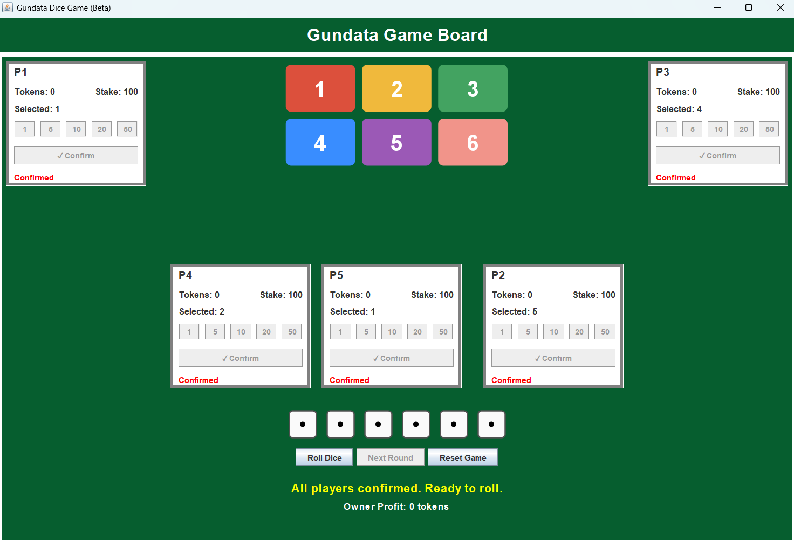
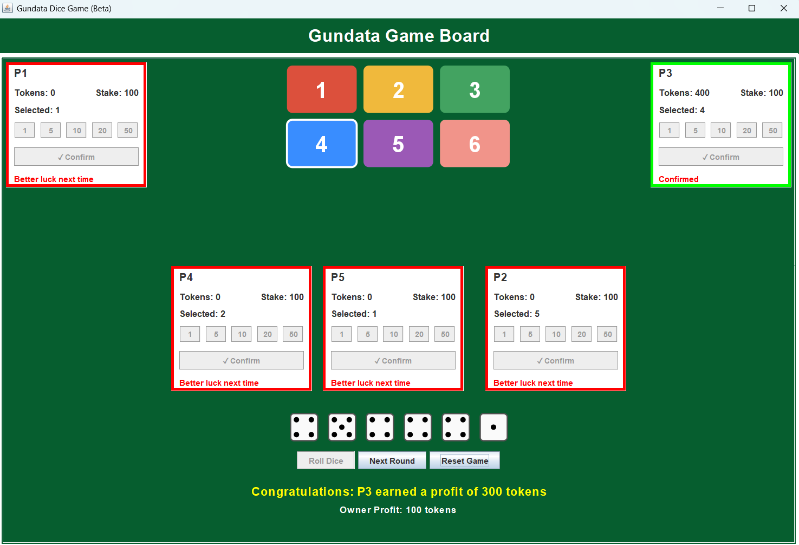
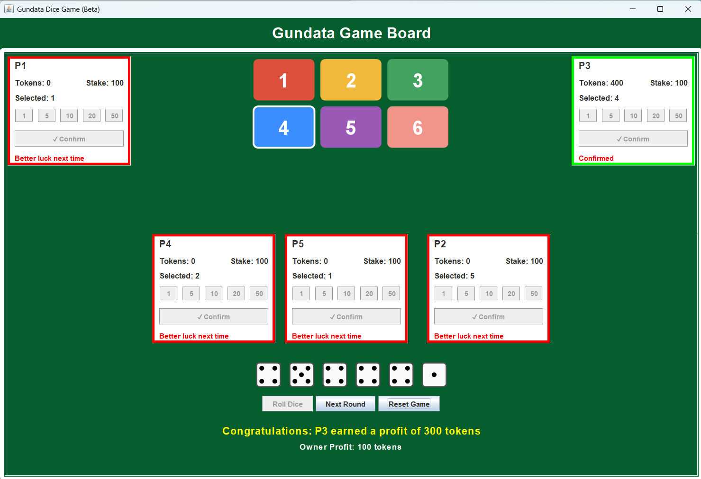
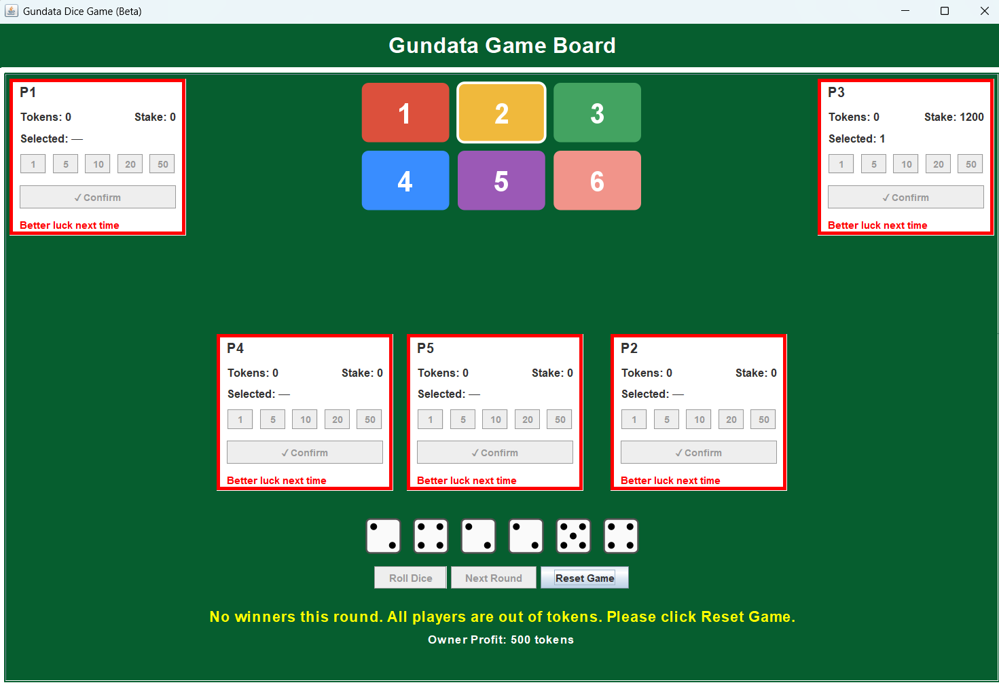

---

# Gundata Dice Game (Beta)

## Overview

The **Gundata Dice Game** is a modernized Java Swing GUI version of a traditional Sankranti dice-based prediction game.
Players start with a number of tokens and place stakes on numbers between 1 and 6.
Six dice are rolled, and the number appearing most frequently determines the winning number.
The owner (computer) distributes winnings to the winners and keeps any remaining tokens as profit.

---

## Game Rules

1. **Starting Tokens:**

   * Each player begins with the same number of tokens (set during player setup).

2. **Placing Stakes:**

   * On their turn, players choose a number (1–6) and place tokens as a stake.

3. **Rolling the Dice:**

   * Six dice are rolled together.
   * The number appearing most frequently becomes the winning number.
   * If there's a tie for the most frequent number, the dice are re-rolled until a single winner emerges.

4. **Payouts:**

   * Winners receive **stake × frequency** tokens.
   * All other stakes go to the owner (computer).

5. **Game End Conditions:**

   * Players with **0 tokens** are marked “Better luck next time” and cannot play further rounds.
   * If all players run out of tokens, the game ends.

---

## GUI Screenshots

### **1. Player Setup and Board Layout**


### **2. All Players Confirmed**



### **3. Winner and Losers Highlighted**



### **4. Round Result with Profit Display**



### **5. All Players Out of Tokens**



---

## Example Calculation

**Setup:**

* 3 players (P1, P2, P3) start with **100 tokens** each.
* Stakes placed this round:

  * P1 → Number 3, stake 20
  * P2 → Number 5, stake 10
  * P3 → Number 3, stake 30

**Dice Roll Result:**
`3, 3, 5, 3, 1, 5`

* Frequency: 3 → 3 times, 5 → 2 times, 1 → 1 time
* **Winning number:** 3 (appears 3 times)

**Payouts:**

* P1: 20 × 3 = 60 tokens (profit +40)
* P3: 30 × 3 = 90 tokens (profit +60)
* P2: loses stake (–10 tokens)

**Owner Profit:**

* Total stakes: 20 + 10 + 30 = 60 tokens
* Total payout: 60 + 90 = 150 tokens
* Owner profit = 60 – 150 = **–90 tokens (Owner Loss)**

---

## How to Run

### **Requirements**

* Java 8+ installed
* Git (optional, for cloning repo)

### **Steps**

```bash
# Clone the whole repo
git clone https://github.com/uthurumella/Final-Project.git
cd Final-Project

# Switch to beta branch
git checkout beta

# Compile
javac *.java

# Run
java Main

```

---

## Current Features

* Supports **1–6 players** with dynamic board layout
* Token-based staking system
* Visual dice animation
* Clear winner and loser indicators:

  * Green border for winners
  * Red border for eliminated players
* Owner profit/loss tracking
* Automatic disabling of players with 0 tokens
* "Better luck next time" message for eliminated players

---

## Future Extension Proposal

**Feature:** Online Multiplayer Mode

* Players can connect remotely via the internet to play the same game session.

**Why Current Design Supports This:**

* **MVC structure** separates game logic (`GameController`) from UI (`GamePanel`), making it easy to swap local inputs with network inputs.
* **Player abstraction** means remote players can be handled identically to local players, with only the input source changing.
* **Event-driven actions** allow easy injection of remote commands.

**Other Possible Extensions:**

* AI-controlled computer players
* Advanced rules (multiple number stack, progressive stakes)
* Leaderboard tracking across games

---

## Team Members

* Ravindra
* Uday Kiran
* Sudheer

---


